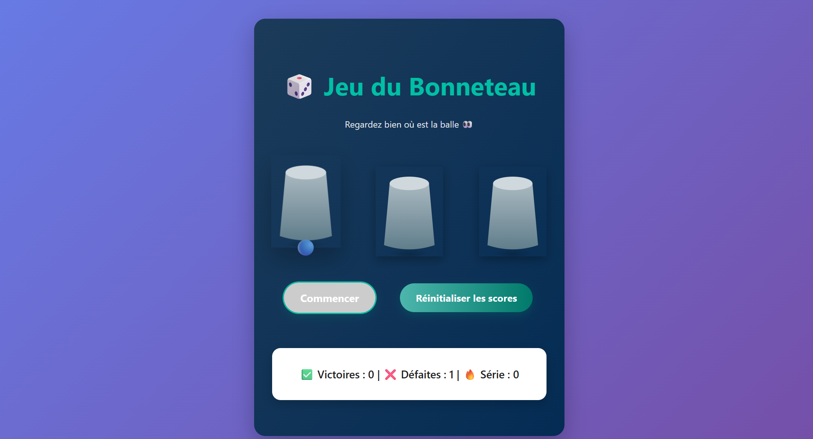
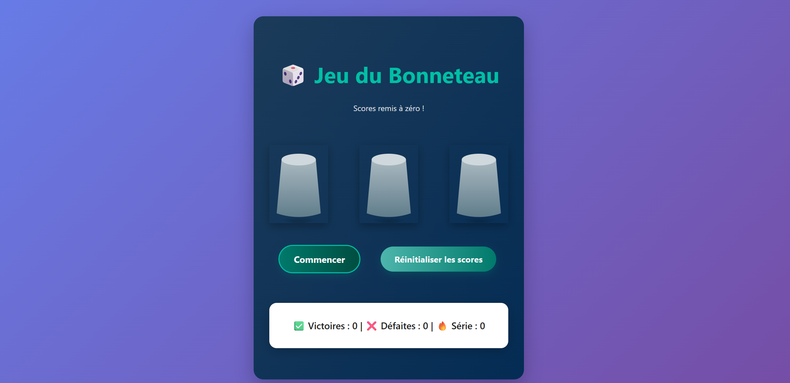

# 🎲 Jeu du Bonneteau

Un jeu du bonneteau interactif développé avec **Vue 3**, **TypeScript** et **Vite**.



## 🕹️ Principe du jeu

Le but est de retrouver la balle cachée sous l'un des trois gobelets après un mélange aléatoire. Testez votre mémoire et votre chance !

- Cliquez sur "Commencer" pour démarrer une partie.
- Observez bien où se trouve la balle.
- Après le mélange, cliquez sur le gobelet où vous pensez que la balle se trouve.
- Le score et la série de victoires sont sauvegardés localement.



## 🚀 Démarrage rapide

### Prérequis

- Node.js (v18+ recommandé)
- npm

### Installation

<!-- Clonez ce dépôt  -->
        ```bash
        git clone   git@github.com:Franckprivat/Shell-Game.git
        ```
        ou 

        ```bash
        git clone https://github.com/Franckprivat/Shell-Game.git
        ```

<!-- Allez dans le dossier du projet -->
        ```bash
        cd jeu du bonneteau
        ```

<!-- Installez les dépendances -->
        ```bash
        npm install
        ```

### Lancer le serveur de développement

```bash
npm run dev
```

Ouvrez [http://localhost:5173](http://localhost:5173) dans votre navigateur.

### Build pour la production

```bash
npm run build
```

### Utilisation avec Docker

Vous pouvez lancer l'application dans un conteneur Docker pour simplifier le déploiement.

#### 1. Construire l'image Docker

```bash
docker build -t jeu-du-bonneteau .
```

#### 2. Lancer le conteneur

```bash
docker run -p 8080:80 jeu-du-bonneteau
```

L'application sera alors accessible sur [http://localhost:8080](http://localhost:8080).

> ⚠️ Assurez-vous que le port 8080 n'est pas déjà utilisé sur votre machine.

## 🧪 Tests unitaires

Le projet utilise **Vitest** et **@vue/test-utils** pour les tests unitaires.

- Lancer les tests :
  ```bash
  npm run test
  ```

## 📁 Structure du projet

```
jeu-bonneteau/
├── src/
│   ├── components/
│   │   └── Game.vue      # Composant principal du jeu
│   ├── main.ts           # Point d'entrée de l'app Vue
│   ├── style.css         # Styles globaux
│   └── assets/           # Images
├──               # Fichiers statiques (favicon, etc.) 
Tests unitaires
    └──Tests/
        ├── Game.spec.ts  #
        ├──setup.ts       #

├──dockerfile
├── index.html            # Fichier HTML principal
├── package.json
└── README.md
```


## ✨ Fonctionnalités

- Animation de mélange des gobelets (mélange, victoire, défaite);
- Score et série sauvegardés en local;
- Responsive et design moderne;

## 🤝 Contribuer

1. Fork le repo
2. Crée une branche (`git checkout -b feature/ma-feature`)
3. Commit tes modifications (`git commit -am 'feat: nouvelle fonctionnalité'`)
4. Push la branche (`git push origin feature/ma-feature`)
5. Ouvre une Pull Request

## 📄 Licence

Projet open-source sous licence MIT.


Contact
Pour toute question ou suggestion :

Email : franck.kiemde@epitech.eu
